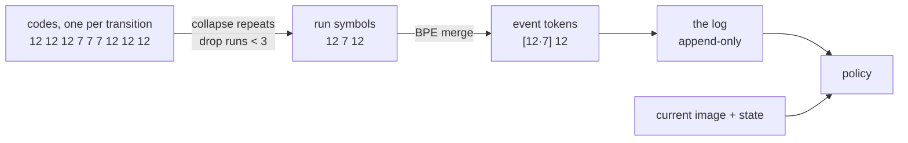
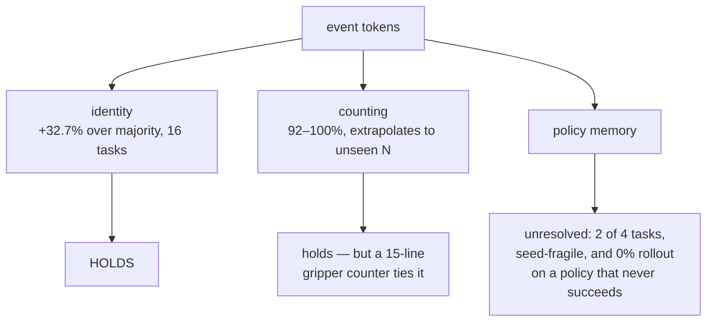

# Event Tokenizer — status

**v2.0 — 2026-08-24** · target: CoRL workshop
*(v1.0 was a plan. This is a status document: what was measured, what survived, what was retracted.
`_archive_event_tokenizer_v1.md` records how we got to v1. The spiking-memory line is parked in
`archive/`.)*

**Read §0 first.** Several results in v1.0 of this document did not survive their controls.

---

## 0. What actually holds, as of 2026-08-24

| claim | status | evidence |
|---|---|---|
| Event tokens carry event identity | **holds** | +32.7% median gain over majority, 16 tasks; better than per-frame codes on 13/16 |
| Tokens are coherent event units | **holds** | mean purity 0.94 — a token sits inside one event |
| Counting works | **holds, but not distinguishing** | 92–100% vs ~37% chance — and a 15-line gripper counter ties it |
| Counting extrapolates to unseen N | **holds, but not distinguishing** | 96% on PickXtimes N∈{4,5}; gripper counter also 96%, MAE 0.04 |
| The method generalises beyond dev tasks | **holds** | dev +22.3% vs unseen +23.1% median, no gap |
| Multimodal tokens beat action-only | **RETRACTED** | action+vision tokens *lose* on 4/4 (BC) and 3/4 (DP) |
| A policy reads the log | **unresolved** | held on a leaky log; on a causal log the effect is 2-of-4 and seed-fragile |
| The log helps a robot succeed | **untested** | rollout returns 0% in every condition — no resolution |
| The learned tokenizer beats k-means | **RETRACTED** | ties action-only, loses with vision, at matched codebook size |
| Pooling memory destroys the count | **holds** | 4/4 tasks, via content share; but see §6 on the confound |

**The one-sentence summary.** The tokenizer produces good event representations. There is no
demonstrated downstream use for them yet, and the experiment that could show one has not been run
against a policy competent enough to measure.

---

## 1. The claim

Tokenize a robot's own experience into a short sequence of discrete **event tokens**, feed them back
as context, and the policy has memory.

> **Novelty statement.** Boundary-coupled variable-length **quantization** feeding an
> **append-only, count-preserving** event token log.

Two supporting arguments, and their current standing:

1. **Token sequences preserve repetition; consolidation destroys it.** *Standing: supported.* Pooling
   the log into a `global_cond` vector either collapses the memory benefit (SwingXtimes −8.8%→−2.0%,
   VideoRepick −8.7%→+1.4%) or halves its content dependence (81%→59%, 134%→75%), on 4/4 tasks.
2. **Text-valued tokens transfer with zero adaptation.** *Standing: untested, and blocked.* Naming a
   token requires the ground-truth subgoal labels to fit a lookup table. There is no unsupervised
   path from token to name, so the text-transfer claim has no implementation.

---

## 1.5 The pipeline, in pictures

### How one code is produced

k-means does **not** run on actions with vision bolted on afterwards. Both modalities are
turned into vectors, normalised, **concatenated**, and k-means runs on the joined vector.
One transition in, one integer out. Real shapes, SwingXtimes at `scale=2x2`:

```
ONE TRANSITION t
│
├─ action chunk ─────────────────────────────────────────────────────────┐
│    actions[t]                            (20 steps × 8 dims)           │
│    minus state[t] on dims 0..6           ← delta, so the same motion    │
│    ÷ per-dim std (dead dims → 0)           looks alike anywhere         │
│    flatten                               → 160-d                       │
│    scale so total variance = 1.0         → 160-d  ─────────────────────┤
│                                                                        │
├─ visual features ──────────────────────────────────────────────────────┤
│    feat_t                                (4 tokens × 2048)             │
│    feat_{t+20} − feat_t   ← the change   (4 tokens × 2048)             │
│    concat + flatten                      → 16384-d                     │
│    centre  ← 99.8% of SigLIP's energy is a constant; skip this and     │
│              k-means clusters that constant                            │
│    PCA                                   → 64-d                        │
│    scale so total variance = 1.0         → 64-d   ─────────────────────┤
│                                                                        │
└─ CONCATENATE ──────────────────────────────────────────────────────────┘
                                           → 224-d vector for transition t
                                                    │
                                    nearest of k centroids
                                                    │
                                                    ▼
                                            code, e.g. 12
```

Equal variance per block is why they combine at all: raw, the 16384-d vision block would
swamp the 160-d action block by sheer dimension count. It is also a fixed choice that can
be wrong — on PatternLock vision carries no signal, so equal weighting spends half the
distance budget on noise, which is what `vision_weight` exists to fix.

### From codes to the log



Each arrow discards something. That is intended — the point is a short, countable
sequence — but it is also why the log can never beat the raw actions it summarises (§6.1).

### Why the log and the action chunk are complementary, not rivals

One SwingXtimes episode is ~430 steps. The policy's action chunk sees 32 of them.

```
episode  ├────────────────────────────────────────────────────────────┤  ~430 steps
              swing 1        swing 2        swing 3        press button
         ├────────────┤ ├────────────┤ ├────────────┤ ├──────────────┤

rawhist                                              ├──┤   32 steps ≈ 7% of the episode
                                                     └─ can see: the current motion
                                                        cannot see: that 2 swings already happened

log      ▸12 ▸7  ▸12 ▸7  ▸12 ▸7                            ~6 tokens, spans everything
         └─ can see: the whole history, countable
            cannot see: fine detail of the last second
```

This is why `log` vs `rawhist` was the wrong experiment and `rawhist+log` vs `rawhist`
is the right one.

### The future leak, and the fix

Whole-episode BPE, then filtering by span end, is **not** causal:

```
runs so far:   A B                    encode → [AB]        ← token emitted at t=70
runs so far:   A B C                  encode → [A] [BC]    ← at t=95 the SAME prefix
                                                              now reads differently

           the token at t=70 depended on a run that had not happened yet.
           Measured: 70% of prefixes disagreed with the whole-episode encoding.
```

The fix (`stable_prefix_encode`): a greedy merge cascades leftward by at most the longest
token in the vocabulary, so anything older than that horizon can never change.

```
runs:  A B C D E F G H I J
       └──────── safe ────┘└─ held ─┘        horizon = longest token (not the training cap)
       emit these           may still change
```

Setting the horizon to BPE's *training cap* of 20 blanked the log entirely on
ButtonUnmask, which averages 19.3 runs per episode — the `log` condition became
`none` in disguise (§4.2).

### What the evidence supports



## 2. Data and infrastructure

`/n/netscratch/hankyang_lab/Lab/felix/dataset/robomme/` — 16 tasks × 100 episodes.
Use this copy; the `ydu_lab` copy's `features/` directories are **empty**.

**The simulator exists and works.** ManiSkill 3.0.0b21 + SAPIEN 3.0.3, registered by
`robomme_policy_learning/third_party/robomme_benchmark/src`, in the `robomme` conda env. All 16 tasks
register as gym environments with 50 test episodes each.

- **Runs on H100 and RTX Pro 6000. Fails on A100** with `createDeviceUnique: ErrorInitializationFailed`.
  Pin the gres; a generic `--gres=gpu:1` lands on A100s.
- Actions are **joint-space**: `state = concat(joint_state[7], gripper_state[:1])`, obs keys are
  `joint_state_list` / `gripper_state_list` / `eef_state_list`. There is no `ee_pose` key.
- `HF_HOME` must point at the netscratch cache; compute nodes have no outbound network.

**Existing π0.5 baselines** (MovieChat-QFormer, out of 50): PickXtimes 13, VideoUnmask 14,
PickHighlight 8, SwingXtimes 6, VideoUnmaskSwap 5, BinFill 4, StopCube 1, ButtonUnmask 0,
ButtonUnmaskSwap 0. **The two ButtonUnmask tasks cannot host a memory comparison at any base
policy — they are already at zero.**

---

## 3. The tokenizer

k-means over normalised delta-action chunks, optionally concatenated with centred, PCA-reduced visual
features. `models/streams.build_streams` is the **only** supported way to build a code stream, and its
`tokens` argument is required — see §7 for why that matters.

### 3.1 The learned tokenizer does not earn its place

FSQ (8,8) = 64 codes against k-means k=64, codebook-matched, 16 tasks, identical evaluation path:

| variant | token identity (median Δ) | ahead | boundary F1 (median Δ) | ahead |
|---|---|---|---|---|
| neural, action-only | −0.5% | 7/16 | −0.009 | 6/16 |
| neural, action+vision | −7.1% | 2/16 | −0.044 | 4/16 |

It is not collapsing — it keeps 77% and 88% of its codes alive. It loses while using its vocabulary.
One recipe, one codebook size, 30 epochs, no hyperparameter search, so this does not show learning
cannot help; it shows this learned tokenizer does not. **Build on k-means.**

### 3.2 Normalisation is load-bearing

Two failures, opposite directions, same channel:

- On grasping tasks the gripper's std is ~0.95 against 0.05–0.20 for pose, so an unnormalised loss is
  a gripper predictor.
- On non-grasping tasks (PatternLock, RouteStick) the gripper is **exactly constant**, and flooring
  the divisor at 1e-3 turned normalisation into a 1000× amplifier. Max |normalised action| was 1000
  against 8–12 elsewhere; the learned tokenizer collapsed to 1 of 64 codes on both — the only two
  collapses in fifteen runs. Dead dimensions now get `inf` and normalise to exactly zero.

k-means was **not** affected: a constant coordinate shifts all points identically and leaves Euclidean
distances unchanged. Only the L1 reconstruction target was damaged.

### 3.3 Vision helps identity; it does not help as tokens

Across 16 tasks, action-only 68.3% mean label accuracy vs action+vision 70.5%, better on 12/16. But
when the same multimodal codes are used to build the **memory log**, they lose to action-only tokens
on 4/4 tasks (BC probe, median +10.1%) and 3/4 (diffusion policy, median +6.6%).

Naming an event and helping a policy act are different problems, and vision helps the first.

---

## 4. From codes to event tokens: BPE

### 4.1 BPE is not prefix-stable, and that leaked the future

Encoding the whole episode and then filtering to spans closed by time *t* does **not** produce a causal
log. Appending a run can create an adjacency that fires an earlier merge and rewrites already-emitted
tokens. Measured: **70% of prefixes disagree with the whole-episode encoding.** Every "the policy reads
the log" result before 2026-08-24 rests on a log that could not exist at deployment.

`rollout/online_log.stable_prefix_encode` fixes it: greedy merges cascade leftward by at most the
longest token, so a token ending more than that many runs back can no longer change. Emit those, hold
the rest. Verified 0 unstable prefixes.

### 4.2 The stability horizon must come from the vocabulary, not the training cap

Setting the horizon to BPE's `max_token_length` of 20 blanked the log — episodes have 19–41 runs, and
ButtonUnmask averages 19.3, so its log **never populated** and the `log` condition was silently
identical to `none`. Use `vocab_horizon()` (the longest token actually present), and cap BPE at 4:
mean token width is 2.7–3.5, so the cap costs almost no merging and takes the empty fraction from
66–99% down to 15–42%.

### 4.3 Boundary F1 scores a human convention

The policy never sees RoboMME's annotation convention. A token stream that cuts each event into two or
three pieces is not thereby broken — the robot is not told "swing three times", it learns the mapping
from demonstrations, so a repeated sub-event signature is as usable as one-token-per-event. Counting
bears this out: it ignores the total token count, keys on one recurring pattern, and reaches 96% on
unseen N while boundary F1 on that task is 0.218.

**Do not treat low boundary F1 as a failure of the design.**

---

## 5. Counting

Pattern selected on train episodes using train N only, evaluated on held-out episodes.

- SwingXtimes: 92–100% across every k tested, against ~37% chance.
- PickXtimes, extrapolating to N∈{4,5} never seen in training: **96%**, MAE 0.04, against a 50.3%
  chance baseline (only two values occur in the held-out set, so chance is high, not zero).
- Counting needs **no BPE and no vision** — it works on raw run symbols from action-only k-means at
  k=8, via a single recurring pattern.

**The control that limits this.** Counting gripper open/close cycles — one threshold on one state
dimension, about fifteen lines — reaches **96.0% with MAE 0.04 on the same split**. Identical. On
SwingXtimes the tokenizer wins (100% vs 22%, no grasping so the gripper channel is empty), but
SwingXtimes tops out at N=3 and cannot test extrapolation. So: where extrapolation is testable a
heuristic ties, and where the tokenizer clearly wins extrapolation is untestable.

---

## 6. Does a policy use the log?

### 6.1 The comparison that was mis-specified

`log` was tested against `rawhist` (the last 32 executed actions) as rivals, and lost by ~55 points.
**That framing was wrong.** Memory is high-level and the action chunk still goes in. The log is a lossy
function of that buffer, so it cannot win a head-to-head and losing one carries no information.

The same applies to the ablation ladder (quantisation −15.8%, collapsing repeats −29.3%, BPE −15.2%):
compression losing information relative to its own source is the definition of compression, not a
defect.

**The right test is `rawhist+log` vs `rawhist`,** with `rawhist+wrong` as the control. The scales are
complementary: 32 steps is ~5% of a 400–800 step episode, so the chunk cannot see a repetition from
300 steps ago and the log spans the whole episode. *Running as of 2026-08-24.*

### 6.2 What the causal log shows

On a properly populated causal log, with three seeds — memory helps on **2 of 4** tasks reliably
(SwingXtimes −8.6/−10.1/−9.4%, VideoRepick −12.2/−15.5/−14.8%), is directionally positive but
4× variable on PickXtimes, and **flips sign across seeds** on ButtonUnmask (+1.7/−12.0/−5.7%).

Report no single-seed number. Three seeds changed two of four conclusions.

### 6.3 Pooling destroys the memory — the plan's objection holds

Content share is the right metric: a ratio computed inside one conditioning mode, so the observation
handicap and the headroom it creates both cancel. Raw cross-mode comparisons are confounded — pooling
handicaps the *vision* tokens by 15–30% before any memory is involved.

| task | how pooling fails |
|---|---|
| ButtonUnmask | content share 81% → 59% |
| PickXtimes | content share 134% → 75% |
| SwingXtimes | benefit collapses −8.8% → −2.0% |
| VideoRepick | benefit collapses −8.7% → **+1.4%** |

Cross-attention beats pooling on absolute L1 4/4. **This rules out Diffusion-Policy-style
`global_cond` conditioning**, as §5 of v1.0 predicted.

---

## 7. Method notes that cost real time

- **Validate on ≥2 structurally different tasks from the start.** Every retracted decision — 512
  codes, no vision, code-change boundaries, "concat hurts" — traces to a SwingXtimes-only measurement.
- **Run ≥3 seeds before quoting an effect under ~10%.** Seeds flipped two of four conclusions.
- **Always report the baseline on the same line.** Five numbers were misread without one, including
  MI read as accuracy and counting with no chance level.
- **The token source drifted to action-only twice.** The cause was interface convenience:
  `KMeansTokenizer.stream_for_episode()` existed and the multimodal equivalent did not, so the
  function with the right signature beat the one with the right semantics. `build_streams` now
  requires the argument.
- **Silent fallbacks hide bugs.** `obs.get("ee_pose", zeros(8))` returned plausible zeros for a key
  that does not exist; an `echo` after a crashed python set the exit code so slurm recorded
  `COMPLETED` for 16 dead cells; a probe reported its own `TypeError` as a driver verdict.
- **Smoke-test the write path before a long run.** A 16-cell, 150-epoch sweep was lost to an unbound
  variable on the last line.

---

## 8. Where this goes next

**From-scratch Diffusion Policy is not the vehicle.** Trained on 50 episodes of one task it gets
**0/20 success**, with 19/20 timeouts — so every offline number is measured on a policy that never
completes the task, and the mapping from action-prediction L1 to success rate is unknown and possibly
flat. v1.0 §5 specified π0.5 and other VLAs; that was right and this deviated from it.

Two open items, in order:

1. **Diagnose or abandon the from-scratch DP.** Does it succeed on its *own training* episodes? Under
   an hour, and decisive: if it cannot reproduce demonstrations it was fit on, 0% is a misconfiguration
   (4 visual tokens at 2×2 pooling is very coarse; 20-step chunks execute open-loop with no
   replanning) rather than evidence about from-scratch policies.
2. **Put the log into π0.5**, where base competence exists (6/50 SwingXtimes, 13/50 PickXtimes). That
   is the headroom a memory comparison needs. Condition by cross-attention over the token sequence,
   never a pooled vector (§6.3).

**What a defensible workshop paper says today:** the tokenizer produces consistent, nameable,
countable event representations that generalise across 16 tasks; keeping them as a sequence rather
than pooling them matters; and the counting benchmark on RoboMME does not distinguish them from
task-specific heuristics. The memory claim is not yet supported and should not be made.
